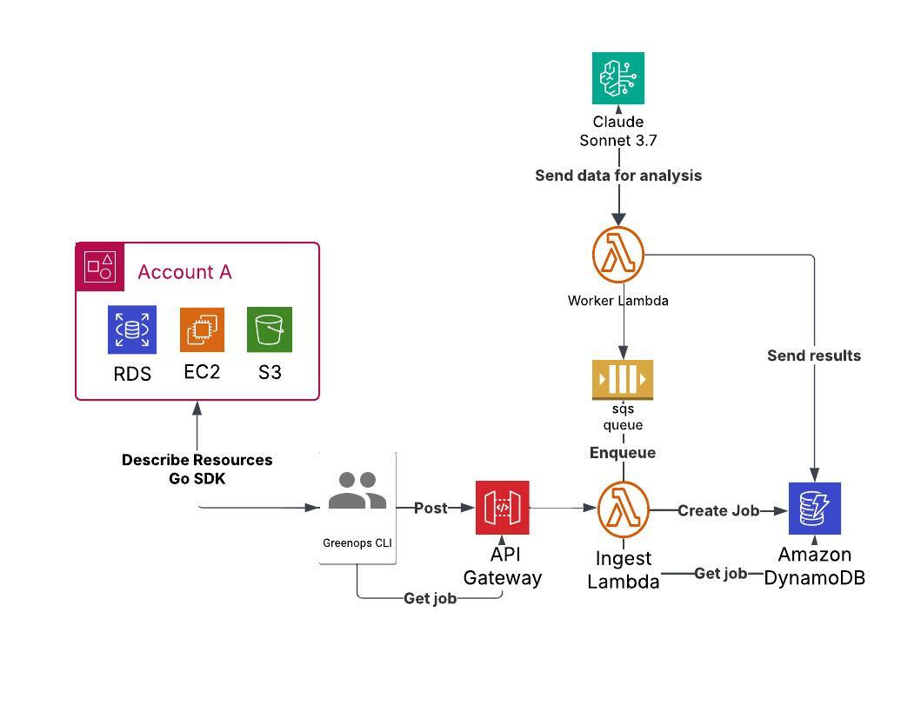

# GreenOps - AWS Resource Sustainability Analyzer

GreenOps is a sustainability-focused CLI tool that analyzes AWS resources (EC2 instances, S3 buckets, and RDS databases) to provide optimization recommendations for reducing carbon footprint and costs.


This project was developed as a single-person hackathon project to explore the intersection of cloud computing and sustainability.

## Prerequisites

- AWS account with permissions for EC2, S3, RDS, Lambda, API Gateway, SQS, DynamoDB, and Bedrock
- AWS Bedrock access with Anthropic Claude and Amazon Titan models enabled
- Go 1.23+ installed
- Terraform

## Quick Start

### 1. Clone the repository

```bash
git clone https://github.com/yourusername/greenops.git
cd greenops
```

### 2. Configure AWS credentials

```bash
export AWS_PROFILE=your-profile-name
export AWS_REGION=your-region
```

### 3. Enable AWS Bedrock models

In the AWS Console:
- Navigate to Amazon Bedrock
- Go to Model access
- Request access to:
  - Amazon Titan Embeddings G1 - Text (used for embeddings)
  - Anthropic Claude 3.7 Sonnet (used for analysis)

### 4. Set up the inference profile

```bash
export GEN_PROFILE_ARN=arn:aws:bedrock:your-region:your-account-id:inference-profile/eu.anthropic.claude-3-7-sonnet-20250219-v1:0
```

### 5. Build the project

```bash
make build
```

### 6. Deploy infrastructure (optional)

```bash
terraform init
terraform apply
```

### 7. Run GreenOps

```bash
# Analyze a single EC2 instance (for testing)
./greenops

# Analyze multiple resource types
./greenops --resources=ec2,rds --limit 10

# Save output to file
./greenops --output=results.json
```

## Features

- **Resource Analysis**: Scan EC2 instances, S3 buckets, and RDS databases for optimization opportunities
- **AI-Powered Recommendations**: Uses AWS Bedrock (Claude) to generate detailed sustainability recommendations
- **CO2 Footprint Estimation**: Calculates the carbon footprint of your cloud resources
- **Cost Optimization**: Identifies potential cost savings alongside environmental benefits
- **Serverless Architecture**: Lambda-based backend for efficient processing
- **CLI Output**: Color-coded, organized reports directly in your terminal

## Architecture

GreenOps consists of:



1. **CLI client**: A Go-based command-line tool that scans your AWS environment
2. **API Gateway**: HTTPS endpoint for submitting resources for analysis
3. **Lambda Function**: Processes analysis requests and manages jobs
4. **SQS Queue**: Distributes work items for parallel processing
5. **Worker Lambda**: Analyzes individual resources using AWS Bedrock
6. **DynamoDB**: Stores analysis results and job status


## CLI Options

```
GreenOps CLI
A tool for optimizing AWS resource usage and reducing carbon footprint.

Options:
  --api string        GreenOps API URL (default "https://8tse26l4fi.execute-api.eu-west-1.amazonaws.com/analyze")
  --async             Use asynchronous processing mode (default true)
  --config string     Path to configuration file
  --debug             Enable debug logging
  --init              Generate a default configuration file
  --limit int         Maximum number of resources to scan (default 10)
  --no-color          Disable colorized output
  --output string     Save results to file (default outputs to stdout)
  --poll-interval int Polling interval in seconds for async mode (default 5)
  --poll-max int      Maximum number of polling attempts (default 60)
  --profile string    AWS Profile (defaults to AWS_PROFILE env var or default profile)
  --region string     AWS Region (defaults to AWS_REGION env var or config file)
  --resources string  Comma-separated list of resources to scan (default "ec2,s3,rds")
  --timeout int       API request timeout in seconds (default 60)
  --verbose           Show debug and scan logs (stderr)
```

## Example Output

The tool generates formatted output with color-coding (when supported):

```
    ____                     ____            
   / ___| _ __ ___  ___ _ __|  _ \ _ __  ___ 
  | |  _ | '__/ _ \/ _ \ '_ \ |_) | '_ \/ __|
  | |_| || | |  __/  __/ | | |  __/| |_) \__ \
   \____|_|  \___|\___|_| |_|_|   | .__/|___/
        Optimize AWS for Sustainability       

GreenOps Analysis Report
========================
Generated: Wed, 24 Apr 2025 12:00:00 EST

╔══════════════════════════════════════════════════════════════╗
║                SUSTAINABILITY IMPACT SUMMARY                  ║
╚══════════════════════════════════════════════════════════════╝

METRIC          CURRENT           POTENTIAL         SAVING%
CO2 Emissions   42.52 kg CO₂e     12.75 kg CO₂e     70.0%
Cost ($)        345.87            103.76            70.0%

ENVIRONMENTAL EQUIVALENTS
─────────────────────────
• Current emissions equivalent to: 24.3 trees absorbing CO2 for one month
• Optimization would save the equivalent of: 17.0 trees per month
• Current emissions equivalent to driving 105.2 miles (169.3 km)
• Optimization would save the equivalent of driving 73.6 miles (118.5 km)

ANNUAL PROJECTIONS
──────────────────
• Annual CO2 emissions: 510.24 kg CO2e
• Potential annual CO2 reduction: 357.24 kg CO2e

FINANCIAL IMPACT
───────────────
• Monthly cost: $345.87
• Potential monthly savings: $242.11 (70.0%)
• Projected annual savings: $2,905.32
```

## Development

### Project Structure

```
/cmd
  /cli          - CLI tool source code
  /main.go      - API Lambda function
  /worker       - Worker Lambda function
/pkg            - Shared library code
  /collector.go - EC2 resource collection
  /s3collector.go - S3 resource collection
  /rdscollector.go - RDS resource collection
  /embed.go     - Bedrock embedding functionality
  /analyse.go   - AI analysis functionality
  /formatter.go - Output formatting
/terraform      - Infrastructure definitions
```

### Building from Source

```bash
# Install dependencies
go mod download

# Build binary
go build -o greenops ./cmd/cli

# Build Lambda functions
GOOS=linux GOARCH=amd64 go build -o bootstrap ./cmd/main.go
zip -j function.zip bootstrap

GOOS=linux GOARCH=amd64 go build -o bootstrap ./cmd/worker/main.go
zip -j worker.zip bootstrap
```

## Contribution

This project was created as a single-person hackathon project. Contributions, suggestions, and feedback are welcome!
